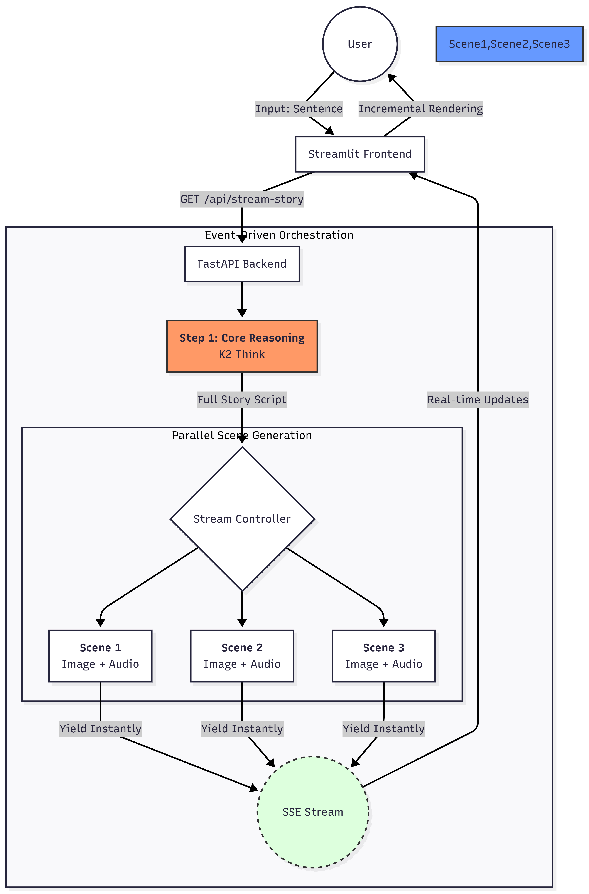

# Vivid Story Generator

AI-powered interactive story generator that creates multi-scene stories with images and narration from a single sentence. Built with event-driven orchestration and real-time streaming.

---

## Architecture

The system uses **event-driven orchestration**: the backend generates a full story script (K2 Think), then produces images and audio per scene in a queue. Each completed scene is yielded immediately via Server-Sent Events (SSE) for incremental rendering in the frontend.



**Flow summary:**
1. **User** → Input sentence → **Streamlit Frontend**
2. **Frontend** → `GET /api/stream-story` → **FastAPI Backend**
3. **Backend** → **Core Reasoning (K2 Think)** → Full story script
4. **Stream controller** → **Parallel scene generation** (Scene 1, 2, 3…) → Image + Audio per scene
5. Each scene **yields instantly** to **SSE stream** → **Real-time updates** → **Incremental rendering** in the frontend

---

## Project Structure

```
Devfest/
├── architecture.png       # System architecture diagram
├── README.md
├── requirements.txt
└── vivid-story/
    ├── app/
    │   ├── main.py        # FastAPI server (SSE streaming, health, static files)
    │   ├── ai_logic.py    # K2 Think & Gemini – story generation
    │   ├── image_gen.py   # Dedalus (GPT-Image-1, DALL-E 2) – image generation
    │   └── media_gen.py   # ElevenLabs – audio generation
    ├── frontend/
    │   └── streamlit_app.py  # Streamlit UI, SSE client, incremental rendering
    ├── data/              # Generated images and audio (temporary storage)
    ├── test_backend.py    # Backend API test script
    ├── .env               # API keys (not committed)
    └── requirements.txt
```

---

## Getting Started

### 1. Install Dependencies

```bash
cd vivid-story
pip install -r requirements.txt
```

### 2. Environment Setup

Create a `.env` file in `vivid-story/` and set:

| Variable | Description |
|----------|-------------|
| `GEMINI_API_KEY` | Google Gemini API key |
| `GOOGLE_CLOUD_PROJECT` | Google Cloud project ID (if using Imagen) |
| `ELEVENLABS_API_KEY` | ElevenLabs API key for narration |
| `K2_THINK_API_KEY` | K2 Think API key for story generation |
| `DEDALUS_API_KEY` | Dedalus API key (GPT-Image-1, DALL-E) for images |

Optional for deployment:

- `API_BASE_URL` or `RENDER_EXTERNAL_URL` – public backend URL (for Streamlit Cloud to load images/audio).

### 3. Run Backend

```bash
cd vivid-story/app
python main.py
```

Server runs at **http://localhost:8000**.

### 4. Run Frontend

In a new terminal:

```bash
cd vivid-story/frontend
streamlit run streamlit_app.py
```

The app opens in your browser. Enter a sentence to generate a story with scenes, images, and audio streamed in real time.

### 5. Test Backend (Optional)

With the backend running:

```bash
cd vivid-story
python test_backend.py
```

---

## Features

- **Story generation** – K2 Think for core story script; Gemini for enhancement/refinement.
- **Image generation** – Dedalus API (GPT-Image-1 for master style, DALL-E 2 per scene); optional style consistency via `use_style_consistency`.
- **Audio generation** – ElevenLabs for scene narration with configurable voice.
- **Real-time streaming** – SSE endpoint streams story pages first, then each scene (image + audio) as soon as it is ready for incremental UI updates.

---

## API Reference

| Method | Endpoint | Description |
|--------|----------|-------------|
| `GET` | `/` | Basic health check |
| `GET` | `/health` | Detailed health check |
| `GET` | `/api/stream-story` | **SSE stream**: story pages + scene events (image + audio URLs) |

### Stream-story query parameters

| Parameter | Type | Default | Description |
|-----------|------|---------|-------------|
| `prompt` | string | required | Story topic/sentence |
| `style` | string | `"fantasy"` | Story style (reserved) |
| `voice` | string | `"default"` | ElevenLabs voice id |
| `num_images` | int | `4` | Number of scenes (images + audio) |
| `use_style_consistency` | bool | `false` | Use GPT-Image-1 master style + DALL-E 2 per page |

### SSE event types

- `story` – Full list of story pages (JSON).
- `scene` – One scene: `image_url`, `audio_url`, `page`, `text`.
- `complete` – Generation finished.
- `error` – Error message.

---

## Tech Stack

- **Backend:** FastAPI, Python 3.10+, Uvicorn
- **Frontend:** Streamlit
- **AI / Media:** K2 Think, Dedalus (GPT-Image-1, DALL-E 2), ElevenLabs
- **Delivery:** Server-Sent Events (SSE), static file serving for generated media

---

## Team Roles

- **Leader:** FastAPI server, SSE integration, API design, UI flow, Media generation(images via Dedalus)
- **Member B:** AI logic (K2 Think), UI flow
- **Member C:** Media generation (audio via ElevenLabs)
